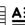
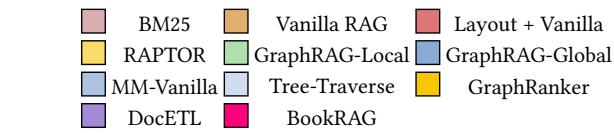
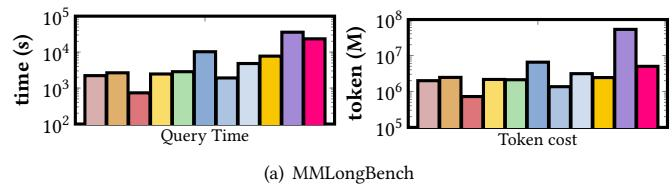
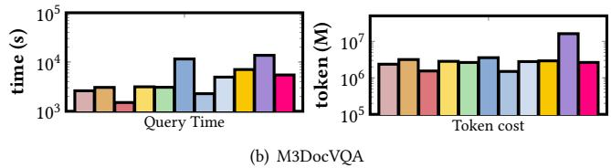

# BookRAG: A Hierarchical Structure-aware Index-based Approach for Retrieval-Augmented Generation on Complex Documents

Shu Wang

The Chinese University of Hong

Kong, Shenzhen

shuwang3@link.cuhk.edu.cn

Yingli Zhou

The Chinese University of Hong

Kong, Shenzhen

yinglizhou@link.cuhk.edu.cn

Yixiang Fang

The Chinese University of Hong

Kong, Shenzhen

fangyixiang@cuhk.edu.cn

# ABSTRACT

As an effective method to boost the performance of Large Language Models (LLMs) on the question answering (QA) task, Retrieval-Augmented Generation (RAG), which queries highly relevant information from external complex documents, has attracted tremendous attention from both industry and academia. Existing RAG approaches often focus on general documents, and they overlook the fact that many real-world documents (such as books, booklets, handbooks, etc.) have a hierarchical structure, which organizes their content from different granularity levels, leading to poor performance for the QA task. To address these limitations, we introduce BookRAG, a novel RAG approach targeted for documents with a hierarchical structure, which exploits logical hierarchies and traces entity relations to query the highly relevant information. Specifically, we build a novel index structure, called BookIndex, by extracting a hierarchical tree from the document, which serves as the role of its table of contents, using a graph to capture the intricate relationships between entities, and mapping entities to tree nodes. Leveraging the BookIndex, we then propose an agent-based query method inspired by the Information Foraging Theory, which dynamically classifies queries and employs a tailored retrieval workflow. Extensive experiments on three widely adopted benchmarks demonstrate that BookRAG achieves state-of-the-art performance, significantly outperforming baselines in both retrieval recall and QA accuracy while maintaining competitive efficiency.

# PVLDB Reference Format:

Shu Wang, Yingli Zhou, and Yixiang Fang. BookRAG: A Hierarchical Structure-aware Index-based Approach for Retrieval-Augmented Generation on Complex Documents. PVLDB, 19(1): XXX-XXX, 2025. doi:XX.XX/XXX.XX

# PVLDB Artifact Availability:

The source code, data, and/or other artifacts have been made available at https://github.com/sam234990/BookRAG.

# 1 INTRODUCTION

Large Language Models (LLMs) such as Qwen 3 [60] and Gemini 2.5 [13] have revolutionized the Question Answering (QA) system [15, 61, 65]. The industry has increasingly adopted LLMs to build QA systems that assist users and reduce manual effort in

This work is licensed under the Creative Commons BY-NC-ND 4.0 International License. Visit https://creativecommons.org/licenses/by-nc-nd/4.0/ to view a copy of this license. For any use beyond those covered by this license, obtain permission by emailing info@vldb.org. Copyright is held by the owner/author(s). Publication rights licensed to the VLDB Endowment.  
Proceedings of the VLDB Endowment, Vol. 19, No. 1 ISSN 2150-8097.  
doi:XX.XX/XXX.XX

  
Figure 1: Comparison of existing methods and BookRAG for complex document QA.

many applications [65, 67], such as financial auditing [29, 37], legal compliance [8], and scientific discovery [56]. However, directly relying on LLMs may lead to missing domain knowledge and generating outdated or unsupported information. To address these issues, Retrieval-Augmented Generation (RAG) has been widely adopted [17, 22] by retrieving relevant domain knowledge from external sources and using it to guide the LLM during response generation. On the other hand, in real-world enterprise scenarios, domain knowledge is often stored in long-form documents, such as technical handbooks, API reference manuals, and operational guidebooks [49]. A notable feature of such documents is that they follow the structure of books, characterized by intricate layouts and rigorous logical hierarchies (e.g., explicit tables of contents, nested chapters, and multi-level sections). In this paper, we aim to design an effective RAG system for QA over long and highly structured documents.

- Prior works. The existing RAG approaches for document-level QA generally fall into two paradigms, as illustrated in Figure 1. The first paradigm relies on OCR (Optical Character Recognition) to convert the document into plain text, after which any text-based RAG method can be directly applied. Among text-based RAG methods, state-of-the-art approaches increasingly adopt graph-based RAG [6, 62, 66], where graph data serves as an external knowledge source because it captures rich semantic information and the

  
Tree I

  
··

  
Entity

  
BookIndex Construction  
GT-Link  
Relation  
Figure 2: The BookIndex Construction process. This phase includes Tree Construction, derived from Layout Parsing and Section Filtering, and Graph Construction, which involves KG Construction and Gradient-based Entity Resolution.

# 4.1 Overview of BookIndex

We formally define our BookIndex as a triplet  $B = (T, G, M)$ . Here,  $T = (N, E_T)$  represents a Tree structure where  $N$  is the set of nodes derived from the document's explicit logical hierarchy (e.g., titles, sections, tables), and  $E_T$  denotes their nesting relationships.  $G = (V, E_G)$  is a Knowledge Graph that captures fine-grained entities  $(V)$  and their relations  $(E_G)$  scattered throughout the document. Finally,  $M: V \to \mathcal{P}(N)$  is the Graph-Tree Link (GT-Link), which links each entity in  $V$  to the set of specific tree nodes in  $N$  from which it was extracted. These links are crucial for capturing the intricate, cross-sectional relations within the document. The hierarchical tree nodes in  $T$  serve as the document's native information patches, providing structured contexts for information seeking. Meanwhile, the entities and relations in  $G$ , connected via  $M$ , act as the rich information scent that guides navigation between and within these patches.

Figure 2 provides an example of our BookIndex. The Tree component, positioned at the top, organizes the document into a hierarchical structure, where content blocks such as text, tables, and images serve as leaf nodes nested within section nodes. The Graph component is composed of entities and relations extracted from these nodes. The GT-Link, illustrated by the blue dotted lines, explicitly connects these entities back to their corresponding tree nodes, thereby grounding the semantic entities within the document's logical hierarchy.

# 4.2 Tree Construction

The first stage transforms the raw document into a structured hierarchical tree  $T$ . This involves two key steps: robust layout parsing and intelligent section filtering.

4.2.1 Layout Parsing. The Layout Parsing phase processes the input document  $D$  (a collection of pages) using layout analysis and recognition models. This step identifies, extracts, and organizes diverse blocks (e.g., text, tables, images) from the document pages.

The output is a sequence of primitive blocks,  $\mathcal{B} = \{b_1, b_2, \dots, b_k\}$ , where each block  $b_i = (c_i, \tau_i, f_i)$  is defined as a triplet. Here,  $c_i$  is the raw content (e.g., text, image data),  $\tau_i$  is the initial layout-based type (e.g., Title, Text, Table, Image), and  $f_i$  is a vector of associated layout features (e.g., "FontSize", bounding box).

4.2.2 Section Filtering. Next, the Section Filtering phase processes this initial sequence to identify the document's logically hierarchical structure. Layout Parsing identifies blocks as Tit1e but does not assign their hierarchical level. Therefore, we select the candidate subset  $\mathcal{B}_{\mathrm{title}} \subset \mathcal{B}$  (where  $\tau_{i} = \mathrm{T}\mathrm{i}\mathrm{t}\mathrm{l}\mathrm{e}$ ) for an LLM-based analysis. To handle extremely long documents, this analysis is performed in batches, where each batch retains a contextual window of high-level section information (with  $l = 1$  as the root). The LLM analyzes the content  $c_{i}$  and layout features  $f_{i}$  of the candidates to determine two key properties: their actual hierarchical level  $l_{i} \in \{1,2,\ldots\}$  and final node type  $\tau_{i}'$  (e.g., re-classifying an erroneous Tit1e as Text if its level is "None"). This step is crucial for preserving the document's logical hierarchy by correcting blocks erroneously parsed as Tit1e, such as descriptive text within images or borderless table headers.

Finally, the definitive tree  $T = (N, E_T)$  is constructed. The node set  $N$  is composed of all blocks from the filtering and re-classification process, where each node  $n \in N$  retains its content  $(c_i)$  and its final node type  $(\tau_i')$  (e.g., Text, Section, Table, and Image). The edge set  $E_T$ , representing the parent-child nesting relationships, is then established. Parent-child relationships are inferred by sequentially traversing the nodes, using both the determined hierarchical levels  $(l_i)$  of Section nodes and the overall document order to assemble the complete tree structure.

As an example shown in Figure 2, the Layout Parsing phase identifies diverse blocks, typing them as Title, Text, Table, and Image. During the Section Filtering phase, the Title candidates (e.g., "Method", "Experiment", and "MOE Layer") are analyzed by the LLM. The blocks "Method" and "Experiment" (both with "FontSize: 14") are correctly identified as Section nodes at "Level: 2". Conversely,

Table 5: Performance comparison of different methods across various datasets for solving complex document QA tasks. The best and second-best results are marked in bold and underlined, respectively.  

<table><tr><td rowspan="2">Baseline Type</td><td rowspan="2">Method</td><td colspan="2">MMLongBench</td><td colspan="2">M3DocVQA</td><td colspan="2">Qasper</td></tr><tr><td>(Exact Match)</td><td>(F1-score)</td><td>(Exact Match)</td><td>(F1-score)</td><td>(Accuracy)</td><td>(F1-score)</td></tr><tr><td rowspan="3">Conventional RAG</td><td>BM25</td><td>18.3</td><td>20.2</td><td>34.6</td><td>37.8</td><td>38.1</td><td>42.5</td></tr><tr><td>Vanilla RAG</td><td>16.5</td><td>18.0</td><td>36.5</td><td>40.2</td><td>40.6</td><td>44.4</td></tr><tr><td>Layout + Vanilla</td><td>18.1</td><td>19.8</td><td>36.9</td><td>40.2</td><td>40.7</td><td>44.6</td></tr><tr><td rowspan="3">Graph-based RAG</td><td>RAPTOR</td><td>21.3</td><td>21.8</td><td>34.3</td><td>37.3</td><td>39.4</td><td>44.1</td></tr><tr><td>GraphRAG-Local</td><td>7.7</td><td>8.5</td><td>23.7</td><td>25.6</td><td>35.9</td><td>39.2</td></tr><tr><td>GraphRAG-Global</td><td>5.3</td><td>5.6</td><td>20.2</td><td>22.0</td><td>24.0</td><td>24.1</td></tr><tr><td rowspan="4">Layout segmented RAG</td><td>MM-Vanilla</td><td>6.8</td><td>8.4</td><td>25.1</td><td>27.7</td><td>27.9</td><td>29.3</td></tr><tr><td>Tree-Traverse</td><td>12.7</td><td>14.4</td><td>33.3</td><td>36.2</td><td>27.3</td><td>32.1</td></tr><tr><td>GraphRanker</td><td>21.2</td><td>22.7</td><td>43.0</td><td>47.8</td><td>32.9</td><td>37.6</td></tr><tr><td>DocETL</td><td>27.5</td><td>28.6</td><td>40.9</td><td>43.3</td><td>42.3</td><td>50.4</td></tr><tr><td>Our proposed</td><td>BookRAG</td><td>43.8</td><td>44.9</td><td>61.0</td><td>66.2</td><td>55.2</td><td>61.1</td></tr></table>

state-of-the-art performance across all datasets, substantially outperforming the top-performing baseline by  $18.0\%$  in Exact Match on M3DocVQA. Layout + Vanilla consistently outperforms Vanilla RAG, confirming that layout parsing preserves essential structural information for better retrieval. Besides, the suboptimal results of Tree-Traverse and GraphRanker highlight the limitations of relying solely on hierarchical navigation or graph-based reasoning, which often miss cross-sectional context or drift into irrelevant scopes. In contrast, BookRAG's superiority stems from the synergy of its unified Tree-Graph BookIndex and Agent-based Planning. By effectively classifying queries and configuring optimal workflows, our BookRAG overcomes limitations of context fragmentation and static query workflow within existing baselines, ensuring precise evidence retrieval and accurate generation.

Table 6: Retrieval recall comparison among layout-based methods. The best and second-best results are marked in bold and underlined, respectively.  

<table><tr><td>Method</td><td>MMLongBench</td><td>M3DocVQA</td><td>Qasper</td></tr><tr><td>Layout + Vanilla</td><td>26.3</td><td>33.8</td><td>33.5</td></tr><tr><td>MM-Vanilla</td><td>7.5</td><td>19.7</td><td>14.9</td></tr><tr><td>Tree-Traverse</td><td>11.2</td><td>19.5</td><td>14.5</td></tr><tr><td>GraphRanker</td><td>26.4</td><td>44.5</td><td>28.6</td></tr><tr><td>BookRAG</td><td>57.6</td><td>71.2</td><td>63.5</td></tr></table>

- Retrieval performance of BookRAG. To validate our retrieval design, we evaluate the retrieval recall of BookRAG against other layout-based baselines on the ground-truth layout blocks. The experimental results demonstrate that BookRAG achieves the highest recall across all datasets, notably reaching  $71.2\%$  on M3DocVQA and significantly outperforming the next best baseline (GraphRanker, max  $44.5\%$ ). This performance advantage stems from our IFT-inspired Selector  $\rightarrow$  Reasoner workflow: the Agent-based Planning first classifies the query, enabling the Selector to narrow the search to a precise information patch, followed by the Reasoner's analysis. Crucially, after the Skyline_Ranker process, the average number of retained nodes is 9.87, 6.86, and 8.6 across the three datasets,

which is comparable to the standard top- $k$  ( $k = 10$ ) setting, ensuring high-quality retrieval without inflating the candidate size.

  
Figure 5: Comparison of query efficiency.

- Efficiency of BookRAG. We further evaluate the efficiency in terms of query time and token consumption, as illustrated in Figure 5. Overall, BookRAG maintains time and token costs comparable to existing Graph-based RAG methods. While purely text-based RAG approaches generally exhibit lower latency and token usage due to the absence of VLM processing for images, BookRAG maintains a balanced efficiency among multi-modal methods. In terms of token usage, BookRAG reduces consumption by an order of magnitude compared to the strongest baseline, DocETL. Notably,